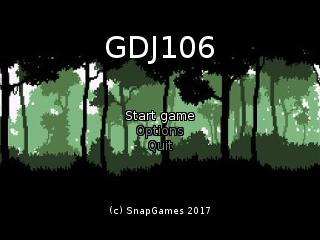
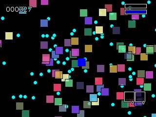
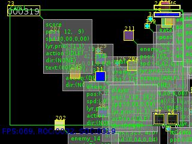
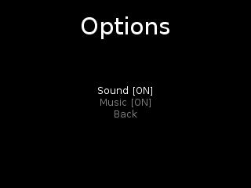

# GDJ107

[](https://travis-ci.org/SnapGames/GDJ107 "open the TravisCI compilation trend") [](https://www.versioneye.com/user/projects/59dd5fd72de28c2198ef86e9 "Open on VersionEye")

## Game Development Java Basics 106

This project is part of the [GDJ107](https://classroom.google.com/c/NzI2ODQ3NjU2MFpa/t/NzI2Nzg0MjgxNFpa) course from [GameDev Basics
Java](https://classroom.google.com/c/NzI2ODQ3NjU2MFpa "Open the official on-line course") 
provided by the [SnapGames](http://snapgames.fr) site. 

### Goal

In this step of course, you will bee discover how to manage collision, manage a HUD and USe a camera to track an active GameObject (like  the Player).

The Google docs corresponding to that course can be find at [GDJ107 - Camera, Collision et HUD](https://docs.google.com/document/d/1ek1M8tnFkciXyRcTje5ClGWW5Ku_AkKlXOOhDiMWIqg "open the corresponding Google Doc.") 

## Compile

To compile the full project, please execute the following command :

```bash
    $> mvn clean install
```

## Execute

to execute the compiled jar, please execute the command bellow :

```bash
    $> mvn exec:java
```

or :

```bash
    $> java -jar GDJ107-0.0.1-SNAPSHOT-jar-with-dependencies.jar
```

## Windows executable

To build a windows executable file, you must run :

```bat
    C:\> mvn clean install site
```

This will build a `GDJ107.exe` into the `target` directory.

Then you can directly execute :

```bat
    C:\> target/GDJ107.exe
```

If needed, you can also add some arguments from the bellow table:

| argument | short  |  sample     | default | Description                                   |
|:--------:|:------:|:-----------:|:-------:|:----------------------------------------------|
| --debug  |   -d   |  -d \[0-4\] | 0       | Request debug information with the level      |
| --height |   -h   |  -h 320     | 320     | Set the width of the window                   |
| --width  |   -w   |  -w 240     | 240     | Set the height of the window                  |
| --scale  |   -s   |  -s 2       | 2       | Set a scale factor for the window             |
| --full   |   -f   |  -f         | off     | switch to fullscreen mode                     |

Executing the following line bello:

```bat
    C:/> target/GDJ107.exe -d 1
```

will open the next window :




## Edit

Import this project as an Existing Maven Project into your prefered IDE, 
(like [Eclipse](http://www.eclipse.org/downloads "open the eclipse official web download page") ?)


## Some screen shots ?

### Play State

The `PlayState` is only a capabilities demonstration purpose state.

 ;

Use the following keys:

- <kbd>D</kbd> / <kbd>F9</kbd> switch between DEBUG modes (see previous table)
    
- <kbd>H</kbd> display a help panel to show keyboard shortcuts :)    
- <kbd>UP</kbd> / <kbd>DOWN</kbd> / <kbd>LEFT</kbd> / <kbd>RIGHT</kbd> to move the blue square which is the `Player` game object,
- <kbd>SHIFT</kbd> / <kbd>CTRL</kbd> with  cursor key will accelerate move,
- <kbd>PG-UP</kbd> / <kbd>PG-DOWN</kbd> will increase decrease number of `Enemy` and `Eatable` game objects (to raise-up your energy), 
- <kbd>SHIFT</kbd> / <kbd>CTRL</kbd> with <kbd>PG-UP</kbd> and <kbd>PG-DOWN</kbd> keys will accelerate increasing.

### Options

The options state is a first version of the options, just to manage Sound and music activation.



> **Info**<br/>
> More to come soon in ths state to manage inputs, sound  and music volume, etc... !

## Maven Repo ?

To publish to the right maven repo, just execute the following lines:

```bash
    $> mvn clean site deploy
```

Before execution, be sure that your `settings.xml` contains a `server` entry with your login/password for the github repository.

	<servers>
		<server>
			<id>github</id>
			<username>[GITHUB-USERNAME]</username>
			<password>[GITHUB-USERPASSWORD]</password>
		</server>
	</servers>

Have Fun !

Send a mail to [SnapGames](mailto:contact@snapgames.fr?subject=GDJ107 "send a mail to your tutor")


